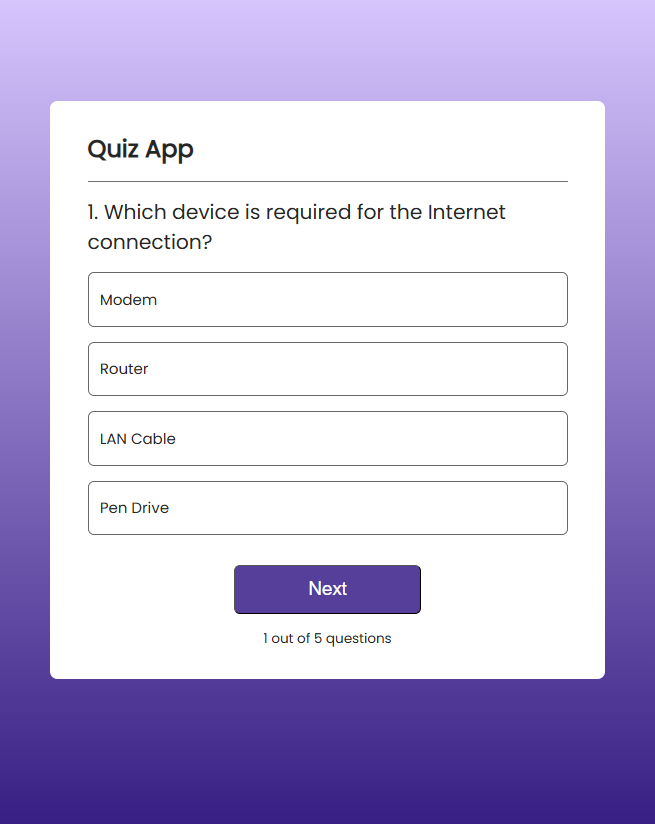

# ⚡ Reactive Quiz

> A snappy, interactive quiz app built with React — where you either ace the questions or react with regret.
> 
> 


---

## 🧠 About

**Reactive Quiz** is a lightweight and fun multiple-choice quiz app built using **React**. It gives instant feedback, tracks your score, and gently mocks your incorrect answers (with colors, not judgment).

---

## ✨ Features

- ✅ Multiple choice questions
- ✅ Answer validation with visual feedback (✔️ / ❌)
- ✅ Live score tracking
- ✅ “Next” button to navigate questions
- ✅ “ReQuiz” to start over when you’ve failed gloriously

---

## 🛠 Tech Stack

- ⚛️ React (Functional Components, Hooks)
- 🎨 CSS (with optional animations or styles)
- 🗃️ Local mock data for questions (`data.js`)

---

## 🚀 Getting Started

Clone and run the app locally:

```bash
git clone https://github.com/pallabm22/reactive-quiz.git
cd reactive-quiz
npm install
npm run dev
>>>>>>> 0e09d66d1d12c592893e2491f85ec799cba6208d
